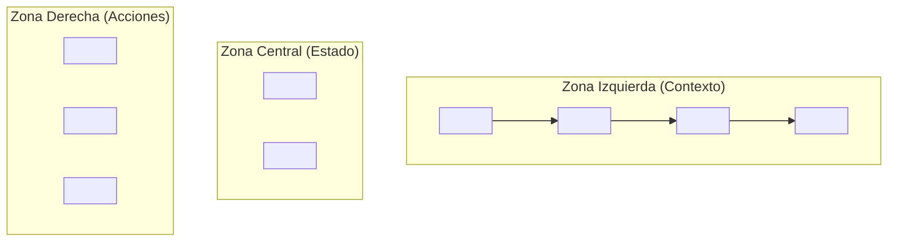

# Propuesta de Arquitectura para el Header del Constructor (`BuilderHeader`)

**ID de Documento:** LIA-DOC-05
**Versión:** 1.0
**Autor:** L.I.A. Legacy
**Contexto:** Este documento detalla la arquitectura de componentes y la distribución de información propuesta para la cabecera del constructor de campañas, basándose en el análisis de interfaces de usuario de nivel de producción como la de Supabase.

---

### 1. Filosofía de Diseño

La cabecera del constructor no es meramente decorativa; es un **Centro de Información y Acciones Contextuales**. Su misión es proporcionar al usuario una conciencia situacional completa y un acceso rápido a las acciones más críticas sin abandonar el flujo de trabajo principal.

### 2. Descomposición Arquitectónica del Header

El header se dividirá en tres zonas lógicas, cada una con una responsabilidad específica, distribuidas horizontalmente para un escaneo visual rápido.

 <!-- Reemplazar con una URL de imagen si es necesario -->

**Zona Izquierda: Contexto de Navegación y Jerarquía**

- **Componente:** `<Breadcrumbs />` o similar.
- **Contenido:**
  1.  **Icono del Workspace Activo:** Muestra el ícono del workspace al que pertenece la campaña.
  2.  **Nombre del Workspace Activo:** Proporciona un enlace navegable para volver a la vista del workspace.
  3.  **Separador (`/`)**
  4.  **Icono del Sitio Activo:** Muestra el ícono del sitio al que pertenece la campaña.
  5.  **Nombre del Sitio Activo:** Enlace para volver a la lista de campañas de ese sitio.
  6.  **Separador (`/`)**
  7.  **Nombre de la Campaña Actual (Editable):** Muestra el nombre de la campaña que se está editando. Debería ser un componente de "edición en línea" que al hacer clic permita al usuario renombrar la campaña rápidamente.
- **Propósito:** Orientar al usuario. Le informa inequívocamente "dónde está" dentro de la jerarquía de la aplicación. Cada segmento es un punto de salida navegable hacia un nivel superior.

**Zona Central: Estado y Metadatos**

- **Componente:** `<StatusIndicators />`
- **Contenido:**
  1.  **Indicador de Guardado (`SaveStatus`):** Un componente dinámico que muestra el estado de los cambios.
      - **Estado por defecto:** `Guardar Cambios` (botón activo si hay cambios sin guardar).
      - **Estado en progreso:** `Guardando...` (con spinner, botón desactivado).
      - **Estado guardado:** `✓ Guardado` (icono de check, botón desactivado).
  2.  **Etiqueta de Entorno/Versión (`EnvironmentTag`):** Una etiqueta visual (ej. "Producción", "Borrador"). Permite al usuario saber si está editando la versión publicada o un borrador.
  3.  **Indicador de Colaboración (`CollaborationIndicator`):** Muestra los avatares de otros usuarios que están viendo (pero no editando) la misma campaña en tiempo real, reforzando la sensación de equipo.
- **Propósito:** Proporcionar conciencia del estado actual del trabajo. Responde a las preguntas: "¿Están mis cambios a salvo?", "¿Qué versión estoy editando?", "¿Quién más está aquí?".

**Zona Derecha: Acciones Globales y de Usuario**

- **Componente:** `<GlobalActions />`
- **Contenido:**
  1.  **Botón de Previsualización (`PreviewButton`):** Un botón con un icono (ej. un ojo) que abre la URL pública de la campaña en una nueva pestaña para una previsualización real.
  2.  **Botón de Publicar/Actualizar (`PublishButton`):** El Call-to-Action principal. Su texto y estado cambian contextualmente (ej. "Publicar", "Actualizar Cambios").
  3.  **Menú de Acciones Adicionales (`kebab-menu | ...`):** Un `DropdownMenu` que contiene acciones secundarias como:
      - Duplicar Campaña
      - Ver Historial de Versiones
      - Mover a otro Sitio
      - Archivar Campaña
  4.  **Menú de Usuario/Ayuda:** Similar al del dashboard principal, proporcionando acceso a la ayuda, feedback y perfil del usuario.
- **Propósito:** Servir como el panel de control para las acciones que afectan a la campaña en su totalidad o a la sesión del usuario.

### 3. Diagrama de Flujo Lógico

