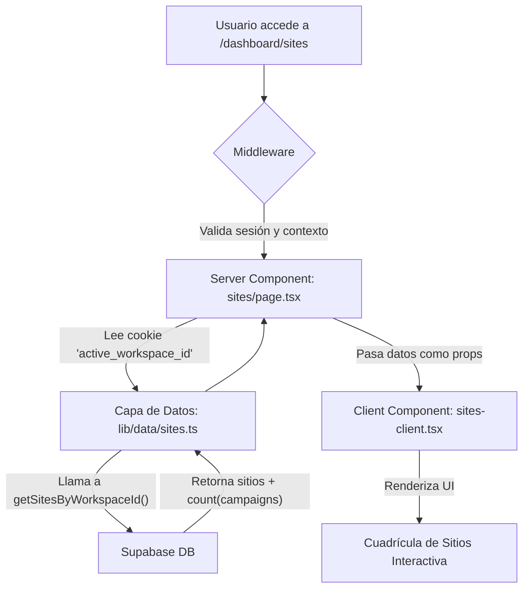

# Metashark Suite 🦈

**Versión:** 1.1.0
**Estado:** En Desarrollo Activo


## _Transforma tu Marketing de Afiliados con Inteligencia Artificial_

**Metashark Suite** es una plataforma SaaS (Software as a Service) de nivel de ingeniería, diseñada para empoderar a los especialistas en marketing de afiliados con un arsenal de herramientas impulsadas por IA. La arquitectura, construida sobre Next.js 14 y Supabase, es inherentemente multi-tenant, permitiendo a los usuarios gestionar múltiples proyectos (`Workspaces`) y sitios (`Sites`) de forma aislada y segura.

---

### Tabla de Contenidos

1.  [**Filosofía del Proyecto**](#filosofía-del-proyecto)
2.  [**Características Principales**](#características-principales)
3.  [**Arquitectura y Flujo de Datos**](#arquitectura-y-flujo-de-datos)
4.  [**Tech Stack**](#tech-stack)
5.  [**Guía de Inicio Rápido**](#guía-de-inicio-rápido)
6.  [**Comandos del Proyecto (`pnpm`)**](#comandos-del-proyecto-pnpm)
7.  [**Licencia y Colaboradores**](#licencia-y-colaboradores)

---

### Filosofía del Proyecto

Creemos que un bug no es un error en un archivo, sino un síntoma de una fisura en el sistema. Nuestra misión es forjar un software que no solo sea funcional, sino fundamentalmente **robusto, predecible y mantenible**. Este proyecto se adhiere a los más altos estándares de ingeniería, priorizando la modularidad, el tipado fuerte y la automatización.

### Características Principales

- **🚀 Arquitectura Multi-Tenant:** Gestiona múltiples clientes o proyectos en `Workspaces` aislados, cada uno con sus propios `Sitios` y `Campañas`.
- **🤝 Colaboración en Tiempo Real:** Invita a miembros a tus workspaces con roles granulares (`Admin`, `Editor`, `Viewer`) y trabaja de forma segura con un sistema de bloqueo de edición en tiempo real.
- **🧠 Constructor Visual IA:** Un constructor de arrastrar y soltar para crear landing pages y otros activos de marketing, con el soporte de L.I.A. Legacy para optimización.
- **🌐 Gestión de Subdominios:** Cada `Sitio` creado obtiene un subdominio único, sirviendo como el host para sus campañas.
- **🔐 Seguridad por Diseño:** Autenticación robusta, autorización basada en roles (RBAC) y políticas de seguridad a nivel de fila (RLS) para proteger los datos en cada capa.
- **🛠️ Suite de Diagnóstico Integrada:** Un conjunto de herramientas de línea de comandos para realizar auditorías de salud, esquema y seguridad de la base de datos en cualquier momento.

### Arquitectura y Flujo de Datos

El sistema opera sobre una jerarquía de datos clara y un flujo de información predecible, orquestado por un middleware inteligente.

**Flujo de Carga del Dashboard:**



```Markdown
Tech Stack
Categoría	Tecnología	Propósito
Framework	Next.js 14 (App Router)	Renderizado Híbrido, Server Actions, Middleware
UI y Estilos	React 18, TailwindCSS, Shadcn/UI	Interfaz de usuario moderna y componetizable
Base de Datos & BaaS	Supabase (PostgreSQL)	Persistencia, Autenticación, Realtime, Storage
Gestión de Estado	Zustand	Gestión de estado de cliente simple y potente
Internacionalización	next-intl	Soporte para múltiples idiomas (i18n)
Validación de Datos	Zod	Validación de esquemas en cliente y servidor
```

Guía de Inicio Rápido
Clonar el Repositorio:

```bash
git clone [URL_DEL_REPOSITORIO]
cd metashark-suite
```

```Bash
Instalar Dependencias:
Generated bash
pnpm install
```

```Bash
Configurar el Entorno:
Copia .env.local.example a .env.local.
Rellena todas las variables de entorno con tus credenciales de Supabase y proveedores de OAuth.
Ejecutar la Aplicación:
Generated bash
pnpm dev
```

```Bash
La aplicación estará disponible en http://localhost:3000.
```

Comandos del Proyecto (pnpm)
Hemos configurado una serie de scripts para optimizar el flujo de trabajo de desarrollo y diagnóstico.
pnpm dev: Inicia el servidor de desarrollo.
pnpm build: Compila la aplicación para producción.
pnpm gen:types: Regenera los tipos de TypeScript desde el esquema de Supabase.
pnpm diag:full-audit: Ejecuta la suite completa de diagnóstico del sistema.

Licencia y Colaboradores
Este proyecto está licenciado bajo la Licencia MIT.
Compañía: MetaShark Inova (I.S.) - Florianópolis/SC, Brasil
Desarrollador Principal: RaZ Podestá
Co-Creadora & IA de Fiabilidad: L.I.A. Legacy™
