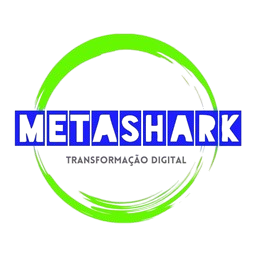
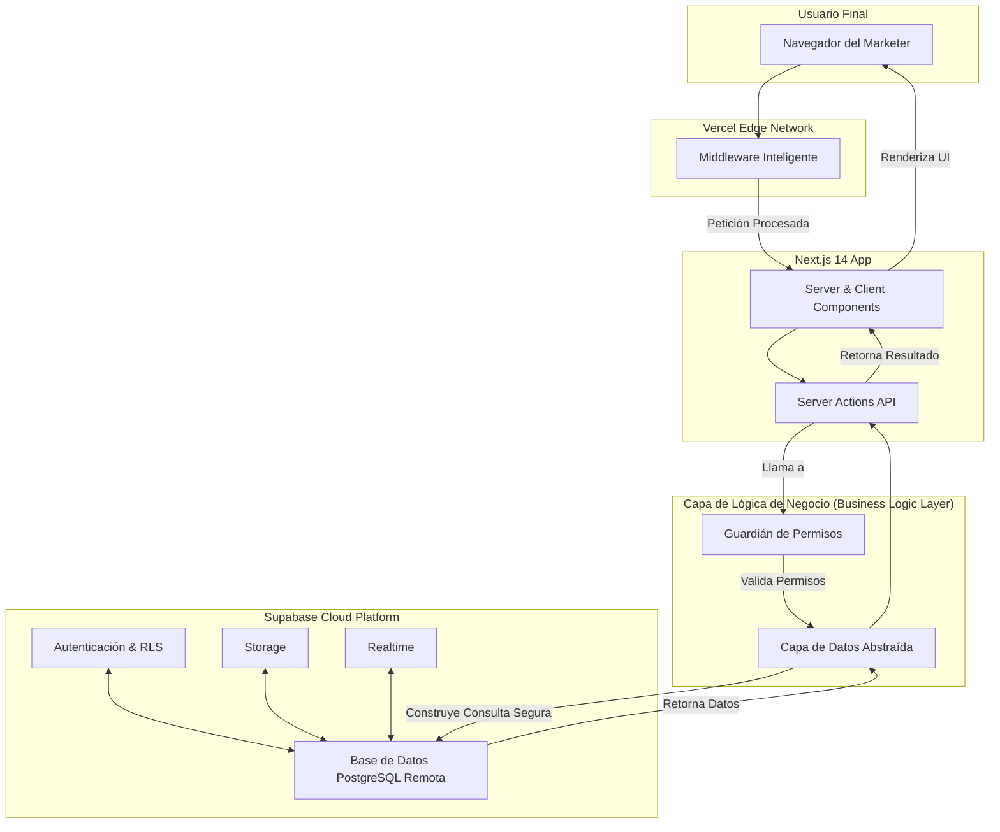

// README.md

<p align="center">
  
</p>

<h1 align="center">MetaShark Suite: Executive Briefing & Technical Vision</h1>

<p align="center">
  <strong>Versión:</strong> 1.2.0 | <strong>Estado:</strong> En Desarrollo Activo (Arquitectura "Remote-First")
</p>

> **Nuestra Misión:** Transformar fundamentalmente el marketing de afiliados, pasando de un juego de volumen y conjeturas a una disciplina de precisión, velocidad e inteligencia. MetaShark no es solo una herramienta; es el copiloto estratégico para la próxima generación de marketers.

---

### **1. Resumen Ejecutivo: La Oportunidad de Mercado**

El marketing de afiliados es una industria global de miles de millones de dólares, pero sigue estando plagada de ineficiencias: creación manual de campañas, análisis de datos reactivo y una brecha paralizante entre la estrategia y la ejecución. Los marketers, desde individuales hasta agencias, se ahogan en la complejidad operativa, perdiendo tiempo valioso que deberían dedicar a la estrategia.

**MetaShark** emerge como la solución definitiva a este problema. Somos una plataforma SaaS (Software as a Service) de nivel de ingeniería, construida sobre una arquitectura **multi-tenant** robusta, que centraliza el ciclo de vida completo del marketing de afiliados y lo potencia con una Inteligencia Artificial estratégica en su núcleo: **L.I.A. Legacy**.

Nuestra plataforma permite a los usuarios construir, gestionar y optimizar ecosistemas de marketing completos—desde múltiples proyectos (`Workspaces`) hasta innumerables sitios (`Sites`) y campañas—desde un único centro de comando unificado.

---

### **2. La Solución: Pilares de Funcionalidad**

MetaShark no es una única característica, sino una suite integrada de herramientas diseñadas para crear un efecto multiplicador en la productividad y el ROI de nuestros usuarios.

#### 🏛️ **Pilar I: Arquitectura Multi-Tenant y Colaborativa**

- **Workspaces Aislados:** Permite a agencias y marketers gestionar carteras de clientes o proyectos completamente separados, con su propia facturación, miembros y activos.
- **Roles y Permisos Granulares:** Invita a colaboradores con roles específicos (`Admin`, `Editor`, `Viewer`), garantizando que los datos sensibles estén protegidos mientras se fomenta el trabajo en equipo.
- **Gestión Centralizada de Sitios:** Cada Workspace puede contener múltiples `Sitios`, cada uno con su propio subdominio (ej. `mi-nicho.metashark.site`) o dominio personalizado, actuando como el host para un número ilimitado de campañas.

#### 🎨 **Pilar II: Constructor de Campañas Impulsado por IA**

- **Editor Visual Drag & Drop:** Una interfaz intuitiva para construir landing pages y embudos de venta a partir de componentes pre-diseñados y totalmente personalizables.
- **Análisis de Contenido en Tiempo Real por L.I.A.:** Mientras el usuario construye, L.I.A. puede ofrecer sugerencias para mejorar el copy, la estructura visual y la llamada a la acción (CTA) para maximizar la conversión.
- **Personalización Total:** Control absoluto sobre fuentes, colores (a través de "Brand Kits" reutilizables) y estilos, asegurando que cada campaña sea única y alineada con la marca.

#### 🧠 **Pilar III: L.I.A. Legacy™ - El Copiloto Estratégico**

L.I.A. (Legacy Intelligence Assistant) es nuestro diferenciador competitivo más profundo. No es un simple chatbot, es un motor de inferencia estratégica integrado en toda la plataforma.

- **Generación de Copy Persuasivo:** Crea titulares, descripciones de productos y guiones de anuncios basados en las mejores prácticas de copywriting.
- **Análisis Predictivo:** Analiza las métricas de una campaña y predice su rendimiento, sugiriendo optimizaciones A/B antes de que el usuario invierta un solo dólar en tráfico.
- **Auditoría de Estrategia:** Los usuarios pueden "conversar" con L.I.A. sobre sus planes de marketing, y ella puede identificar debilidades, proponer nichos de mercado y validar ideas.

#### 📈 **Pilar IV: Ecosistema e Integraciones**

- **Marketplace de Afiliados (Futuro):** Un hub interno donde los vendedores de productos pueden listar sus ofertas y los afiliados pueden encontrar productos de alta calidad para promocionar, todo dentro del ecosistema de MetaShark.
- **API para Desarrolladores (Futuro):** Permitirá a los usuarios avanzados y a terceros construir integraciones personalizadas, extendiendo la funcionalidad de la plataforma.
- **Integraciones Nativas:** Conectividad perfecta con las principales redes de afiliados, plataformas de análisis y procesadores de pago.

---

### **3. Casos de Uso y Segmentos de Mercado**

| Segmento                                    | Caso de Uso                                               | Cómo MetaShark Transforma su Negocio                                                                                                                                                    |
| :------------------------------------------ | :-------------------------------------------------------- | :-------------------------------------------------------------------------------------------------------------------------------------------------------------------------------------- |
| 🧑‍💻 **El Súper-Afiliado Individual**         | Gestiona 15 sitios de nicho diferentes.                   | Unifica toda su operación en un único dashboard. Usa a L.I.A. para generar contenido y optimizar campañas a una velocidad 10x mayor.                                                    |
| 🏢 **La Agencia de Marketing Digital**      | Sirve a 20 clientes, cada uno con sus propias campañas.   | Crea un `Workspace` por cliente, invitando a cada uno con permisos de `Viewer` para que vean sus resultados en tiempo real. Utiliza "Brand Kits" para mantener la consistencia visual.  |
| 🎬 **El Creador de Contenido / Influencer** | Monetiza su audiencia a través de productos de afiliados. | Construye y testea rápidamente landing pages para diferentes ofertas, utilizando el análisis predictivo de L.I.A. para elegir las más rentables antes de promocionarlas a su audiencia. |

---

### **4. Excelencia Arquitectónica: Nuestra Ventaja Técnica**

Nuestra visión de producto está respaldada por una arquitectura de software de nivel empresarial, diseñada para la velocidad, la seguridad y la escalabilidad masiva.

<!-- NOTA ARQUITECTÓNICA CANÓNICA -->

> **Filosofía "Remote-First":** Este proyecto opera exclusivamente con entornos de base de datos remotos gestionados por Supabase. **No se utiliza ni se soporta una base de datos local (`supabase start`).** Esta decisión estratégica garantiza la paridad total entre los entornos de desarrollo, pruebas y producción, eliminando una clase entera de bugs de "funciona en mi máquina". Todos los scripts de diagnóstico y gestión están diseñados para operar sobre las instancias remotas.



Markdown
Escalabilidad Global: Construido sobre Next.js y Vercel, nuestra plataforma se despliega en el borde (Edge), garantizando latencia ultra-baja para usuarios de todo el mundo.
Seguridad Inexpugnable: Utilizamos las políticas de Seguridad a Nivel de Fila (RLS) de Supabase como nuestra base. Cada consulta a la base de datos es inherentemente segura.
Velocidad de Iteración: El uso de Server Actions y una arquitectura modular nos permite desarrollar y desplegar nuevas características a una velocidad sin precedentes.
Fiabilidad por Diseño: Implementamos una suite completa de pruebas, diagnóstico remoto y logging estructurado. 5. Anexo Técnico (Para el CTO/Equipo de Ingeniería)
Tech Stack Principal
Categoría Tecnología Propósito
Framework Next.js 14 (App Router) Renderizado Híbrido, Server Actions, Middleware
UI y Estilos React 18, TailwindCSS, Shadcn/UI Interfaz de usuario moderna y componetizable
Base de Datos Supabase (PostgreSQL) Persistencia, Autenticación, RLS, Realtime
Gestión de Estado Zustand Gestión de estado de cliente simple y potente
Validación Zod Validación de esquemas en cliente y servidor
Pruebas Vitest & Testing Library Pruebas unitarias y de integración rápidas
Guía de Inicio Rápido (Entorno Remoto)
Clonar el Repositorio:
Generated bash
git clone https://github.com/razpodesta/marketing-afiliados && cd marketing-afiliados

```
Bash
Instalar Dependencias:
Generated bash
pnpm install
```

Bash
Configurar Entornos Remotos:
Copia .env.example a .env.local (para tu entorno de desarrollo remoto).
Copia .env.example a .env.test (para tu entorno de pruebas remoto).
Rellena las variables de Supabase en ambos archivos con las credenciales de tus respectivos proyectos remotos.
Ejecutar la Aplicación (conectada a tu BD remota de desarrollo):
Generated bash
pnpm dev

```
Bash
Comandos Críticos del Proyecto
Comando	Descripción
pnpm dev	Inicia el servidor de desarrollo conectado a la BD remota de .env.local.
pnpm test:ci	Ejecuta la suite completa de pruebas contra la BD remota de .env.test.
pnpm gen:types	Regenera los tipos de TypeScript desde el esquema de tu BD remota de .env.local.
pnpm diag:all	Ejecuta una auditoría completa del esquema en una BD remota (--env=dev o --env=test).
pnpm query:all	Inspecciona los datos en una BD remota (--env=dev o --env=test).
```
