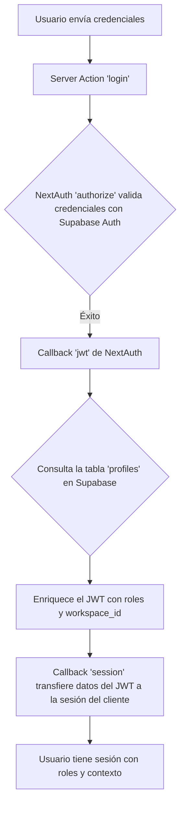

# marketing-afiliados/README.md

# Metashark - Plataforma SaaS Multi-Tenant con Supabase 🦈

Metashark es una plataforma como servicio (SaaS) robusta y escalable construida con Next.js 14 (App Router), Supabase y NextAuth v5. Demuestra una arquitectura multi-tenant moderna donde los usuarios pueden crear "Sitios" que son accesibles a través de subdominios únicos.

---

### Tabla de Contenidos

1.  [**Arquitectura Central**](#arquitectura-central)
2.  [**Tech Stack**](#tech-stack)
3.  [**Flujo de Autenticación y Datos**](#flujo-de-autenticación-y-datos)
4.  [**Estructura del Proyecto**](#estructura-del-proyecto)
5.  [**Potencial y Próximos Pasos**](#potencial-y-próximos-pasos)
6.  [**Guía de Inicio Rápido**](#guía-de-inicio-rápido)

---

### Arquitectura Central

La aplicación opera bajo dos contextos principales, controlados por el middleware:

1.  **Dominio Principal (`marketing-afiliados.com`):** Sirve la página de marketing, las rutas de autenticación (`/login`, `/signup`) y los dashboards protegidos (`/dashboard`, `/admin`) para usuarios autenticados.
2.  **Subdominios (`[subdomain].marketing-afiliados.com`):** Muestra las páginas públicas de los sitios creados por los usuarios (tenants). El middleware reescribe estas peticiones a la ruta interna `/s/[subdomain]`.

### Tech Stack

| Componente               | Tecnología                                                                                                   | Propósito                                     |
| ------------------------ | ------------------------------------------------------------------------------------------------------------ | --------------------------------------------- |
| **Framework**            | [Next.js 14](https://nextjs.org/) (App Router)                                                               | Renderizado híbrido y de servidor.            |
| **UI**                   | [React 18](https://react.dev/), [TailwindCSS](https://tailwindcss.com/), [Shadcn/UI](https://ui.shadcn.com/) | Interfaz de usuario moderna y componetizable. |
| **Base de Datos**        | [Supabase (PostgreSQL)](https://supabase.com/)                                                               | Persistencia de datos, roles y usuarios.      |
| **Autenticación**        | [NextAuth.js v5](https://authjs.dev/)                                                                        | Gestión de sesiones y protección de rutas.    |
| **Internacionalización** | [next-intl](https://next-intl.dev/)                                                                          | Soporte para múltiples idiomas.               |
| **Validación de Datos**  | [Zod](https://zod.dev/)                                                                                      | Validación de esquemas en Server Actions.     |

---

### Flujo de Autenticación y Datos

Utilizamos el **Patrón de Enriquecimiento de JWT con NextAuth y Supabase**, que es seguro y performante.

